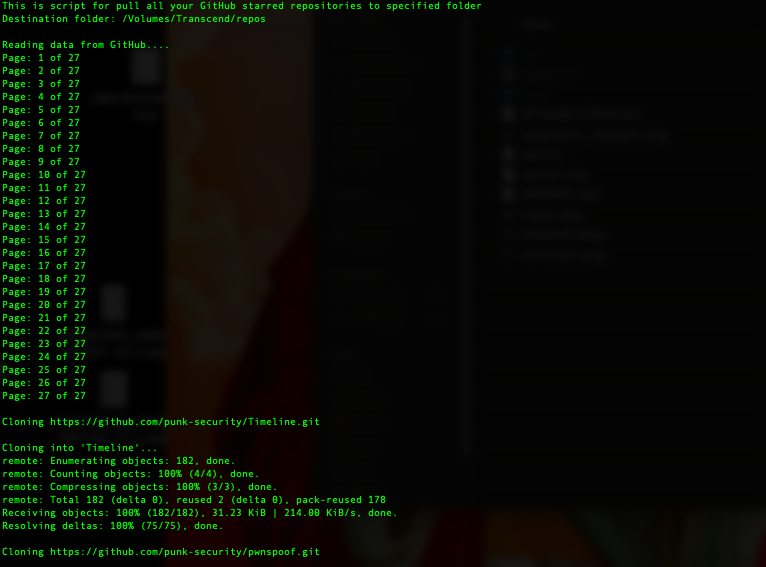
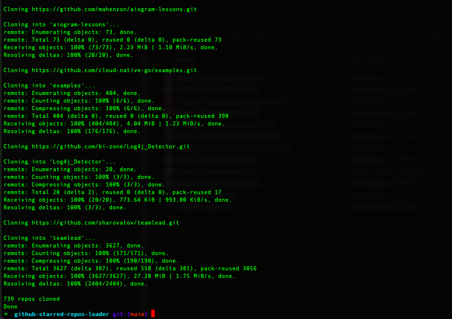

# github-starred-repos-loader

Shell script for pull all your starred GitHub repositories in specifield folder.

## Purposes

This script helps for pull all your GitHub starred repositories locally.

This is typically needed in a situation when you have many stared repositories to clone locally in a folder from remote repositories, such as collection of various utilities, and you want to create a "clear" repositories store from latest versions.

This script does simple things:

>> Gets list of your starred GitHub repositories.
>>
>> git clone in a specified folder
>> 
>> View clone statistics

## That's all!

*It works on GitHub only! (not in GitLab or BitBucket)

## Important

If you have a lot of starred GitHub repositories, and they are big, clone operations may take a long time to complete.

## Usage

- Clone this repository
- Run 'bash pull.sh ', aka this, and wait:

> bash pull.sh "/Volumes/Transcend/repos" "YOUR GITHUB TOKEN"

- Bingo!

## Related projects

Also I use [git-repos-updater](https://github.com/bormaxi8080/git-repos-updater) and [github-starred-repos-builder](https://github.com/bormaxi8080/github-starred-repos-builder) scripts to update my starred GitHub collected repos locally and generates repos description in Markdown format.

## Notes

### How to get your GitHub personal API access token for API:

[https://docs.github.com/en/authentication/keeping-your-account-and-data-secure/creating-a-personal-access-token](https://docs.github.com/en/authentication/keeping-your-account-and-data-secure/creating-a-personal-access-token)

### More about GitHub stars

[https://stars.github.com/](https://stars.github.com/)

### More about GitHub API

[https://docs.github.com/en/rest](https://docs.github.com/en/rest)

## More about GitHub Starred API:

[https://docs.github.com/en/rest/activity/starring](https://docs.github.com/en/rest/activity/starring)

### More About GitHub API Pagination Requests:

[https://docs.github.com/en/rest/guides/traversing-with-pagination](https://docs.github.com/en/rest/guides/traversing-with-pagination)

Example screen:

## TODO

- Add excluded repos list

## Donates

